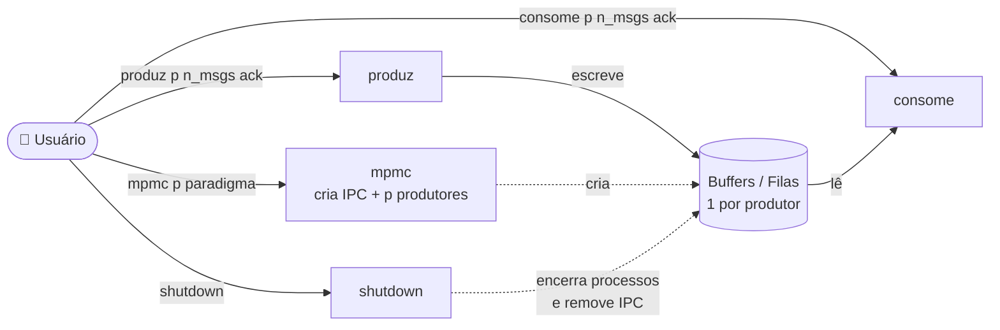

<div align="center">

# 🔄 Múltiplos Produtores / Múltiplos Consumidores

**Trabalho Prático 02/2026 — Sistemas Operacionais**

Universidade de Brasília (UnB) · Departamento de Ciência da Computação
Prof.ª Alba Melo


</div>

---

## 📑 Sumário

- [Objetivo](#-objetivo)
- [Arquitetura](#-arquitetura)
- [Estrutura do projeto](#-estrutura-do-projeto)
- [Compilação](#-compilação)
- [Comandos](#-comandos)
- [Exemplos](#-exemplos)
- [Estruturas de dados](#-estruturas-de-dados)
- [Limpeza de recursos IPC](#-limpeza-de-recursos-ipc)
- [Status](#-status)

---

## 🎯 Objetivo

Desenvolver um sistema de comunicação entre processos **produtores** e
**consumidores** utilizando mecanismos de comunicação entre processos (IPC) do
Linux. O trabalho implementa e compara duas abordagens:

| Paradigma | Valor | Mecanismos IPC |
|-----------|:-----:|----------------|
| 🧠 Memória compartilhada | `1` | `shm` (memória compartilhada) + `sem` (semáforos) |
| ✉️ Troca de mensagens   | `2` | `msg` (filas de mensagens) |

Em ambos os casos, **sinais Unix** também podem ser usados. A solução deve
coordenar a produção e o consumo de mensagens, preservar a integridade dos dados
compartilhados e permitir configurar a quantidade de produtores.

---

## 🏗️ Arquitetura



Cada produtor `p` possui seu próprio buffer (memória compartilhada) ou sua
própria fila (troca de mensagens). Consumidores escolhem de qual produtor
querem consumir.

---

## 📂 Estrutura do projeto

```
trabalho-so/
├── mpmc.c      # inicializa o sistema (IPC + produtores)
├── produz.c    # comando para produzir mensagens
├── consome.c   # comando para consumir mensagens
├── utils.h     # constantes, chaves IPC e estruturas compartilhadas
└── README.md
```

---

## ⚙️ Compilação

Pré-requisitos: **GCC** e um sistema **Linux** com suporte a IPC System V.

```bash
gcc -Wall -o mpmc    mpmc.c
gcc -Wall -o produz  produz.c
gcc -Wall -o consome consome.c
```

---

## 🖥️ Comandos

### `mpmc` — inicia o sistema

```bash
./mpmc p paradigma &
```

| Parâmetro   | Descrição |
|-------------|-----------|
| `p`         | Número de produtores |
| `paradigma` | `1` = memória compartilhada · `2` = troca de mensagens |

### `produz` — envia mensagens

```bash
./produz p n_msgs ack &
```

| Parâmetro | Descrição |
|-----------|-----------|
| `p`       | Produtor que envia. Se `0`, as mensagens são distribuídas em **striped** (`1, 2, …, p, 1, 2, …, p`) |
| `n_msgs`  | Número de mensagens (**1 a 1024**) |
| `ack`     | `1` = espera confirmação de que todas foram consumidas · `2` = não espera |

### `consome` — recebe mensagens

```bash
./consome p n_msgs ack &
```

| Parâmetro | Descrição |
|-----------|-----------|
| `p`       | Produtor do qual consumir |
| `n_msgs`  | Número de mensagens a consumir (**1 a 1024**) |
| `ack`     | Se houver menos mensagens que `n_msgs`: `1` = **bloqueia** · `2` = retorna **erro** informando quantas foram consumidas |

### `shutdown` — encerra o sistema

```bash
./shutdown
```

- ⛔ termina todos os produtores e consumidores;
- ⏱️ imprime o **tempo de execução** de cada processo;
- 🗑️ remove os mecanismos de comunicação (shm, sem, msg);
- 📊 imprime o **número de mensagens consumidas**.

---

## 🧪 Exemplos

<details open>
<summary><b>1. Quatro produtores em memória compartilhada</b></summary>

```bash
./mpmc 4 1 &
./produz 3 2 1 &
./consome 2 2 1 &
./produz 2 5 1 &
./shutdown
```

1. São criados **4 produtores** com as estruturas em memória compartilhada.
2. O produtor 3 produz 2 mensagens e **bloqueia** esperando a confirmação de consumo.
3. O consumidor pede 2 mensagens do produtor 2 e **bloqueia** até elas existirem.
4. O produtor 2 produz 5 mensagens e bloqueia; assim que 2 mensagens são produzidas, o consumidor as consome.
5. A execução é finalizada com o produtor bloqueado e o total de mensagens consumidas é impresso.

</details>

<details>
<summary><b>2. Dois produtores em troca de mensagens</b></summary>

```bash
./mpmc 2 2 &
./produz 3 2 1 &     # >>> retorna erro
./consome 2 2 1 &
./consome 2 2 1 &
./produz 2 5 2 &
./shutdown
```

1. São criados **2 produtores** usando filas de mensagens.
2. `produz 3 ...` retorna **erro**: não existe produtor 3.
3. Dois consumidores pedem 2 mensagens cada do produtor 2 e **bloqueiam**.
4. O produtor 2 produz 5 mensagens **sem bloquear** (`ack=2`).
5. Cada consumidor recebe suas 2 mensagens e termina.
6. A execução é finalizada e o total de mensagens consumidas é impresso.

</details>

<details>
<summary><b>3. Cinco produtores em troca de mensagens (striped)</b></summary>

```bash
./mpmc 5 2 &
./produz 0 15 2 &
./consome 2 3 1 &
./consome 1 2 1 &
./produz 3 2 1 &
./shutdown
```

1. São criados **5 produtores** usando filas de mensagens.
2. 15 mensagens são distribuídas em **striped** nas 5 filas (3 em cada).
3. O primeiro consumidor pede 3 mensagens do produtor 2.
4. O segundo consumidor pede 2 mensagens do produtor 1.
5. O produtor 3 produz 2 mensagens e **bloqueia** aguardando confirmação.
6. A execução é finalizada e o total de mensagens consumidas é impresso.

</details>

---

## 🧱 Estruturas de dados

Definidas em [`utils.h`](utils.h):

| Constante  | Valor    | Significado |
|------------|----------|-------------|
| `MAX_PROD` | `10`     | Número máximo de produtores |
| `MAX_MSGS` | `1024`   | Capacidade do buffer de cada produtor |
| `SHM_KEY`  | `0x1234` | Chave da memória compartilhada |

```c
typedef struct {
    int buf[MAX_MSGS];   // buffer circular de mensagens
    int in;              // próxima posição de escrita
    int out;             // próxima posição de leitura
    int ack;             // modo de confirmação
    int n_msgs;          // mensagens atualmente no buffer
} Prod;

typedef struct {
    Prod prod[MAX_PROD]; // um buffer por produtor
    int consumidas;      // total de mensagens consumidas
    int n_prod;          // número de produtores ativos
} Shared;
```

---

## 🧹 Limpeza de recursos IPC

Se o programa terminar de forma inesperada, os recursos IPC podem ficar
alocados (e `mpmc` falhará com `shmget: File exists`). Para inspecionar e
remover:

```bash
ipcs                      # lista shm, sem e msg ativos
ipcrm -M 0x1234           # remove a memória compartilhada pela chave
ipcrm -a                  # remove TODOS os recursos IPC do usuário
```

---

## ✅ Status

- [x] Validação de argumentos do `mpmc`
- [x] Criação e inicialização da memória compartilhada
- [ ] Criação dos processos produtores (`fork`)
- [ ] Sincronização com semáforos
- [ ] Paradigma de troca de mensagens (`msg`)
- [ ] `produz`
- [ ] `consome`
- [ ] `shutdown`

---

<div align="center">

Feito para a disciplina de **Sistemas Operacionais** — UnB 02/2026

</div>
